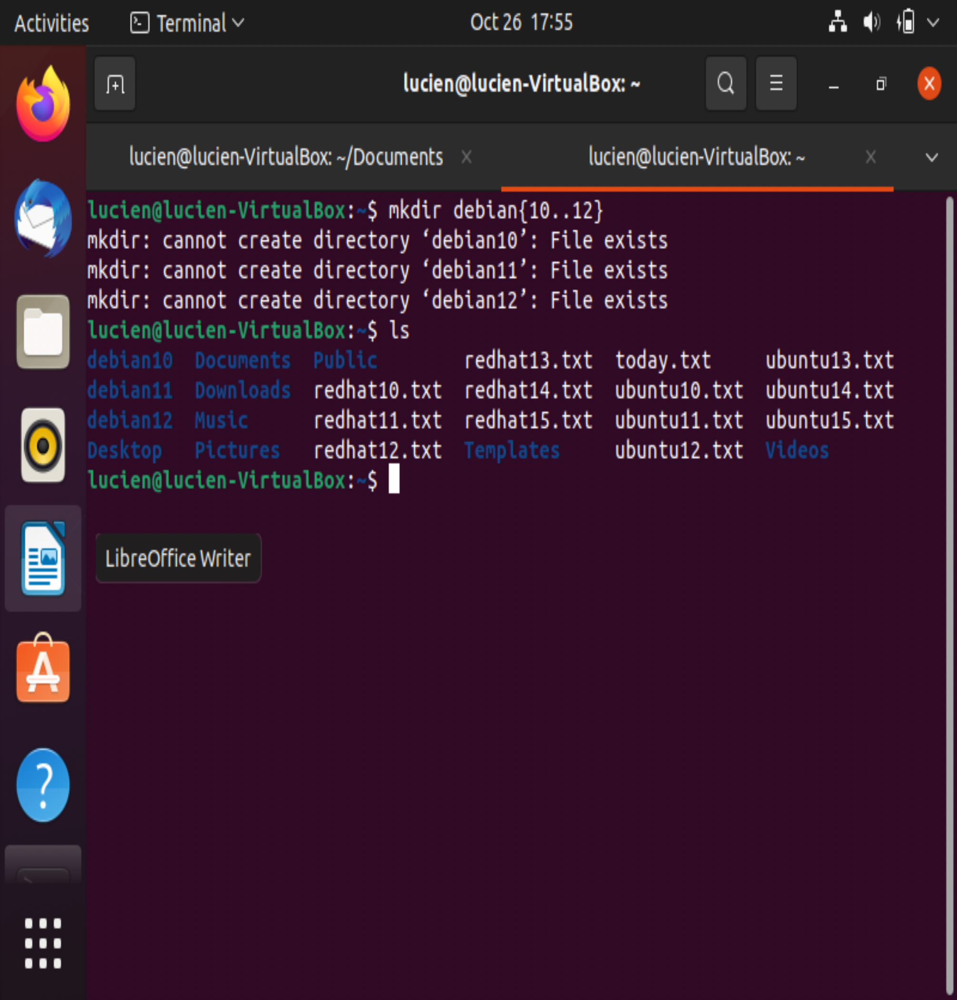
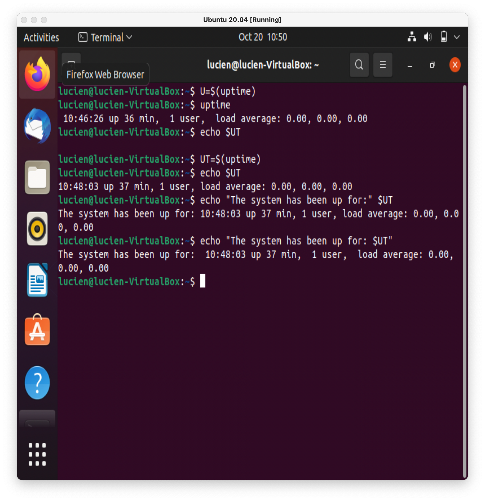
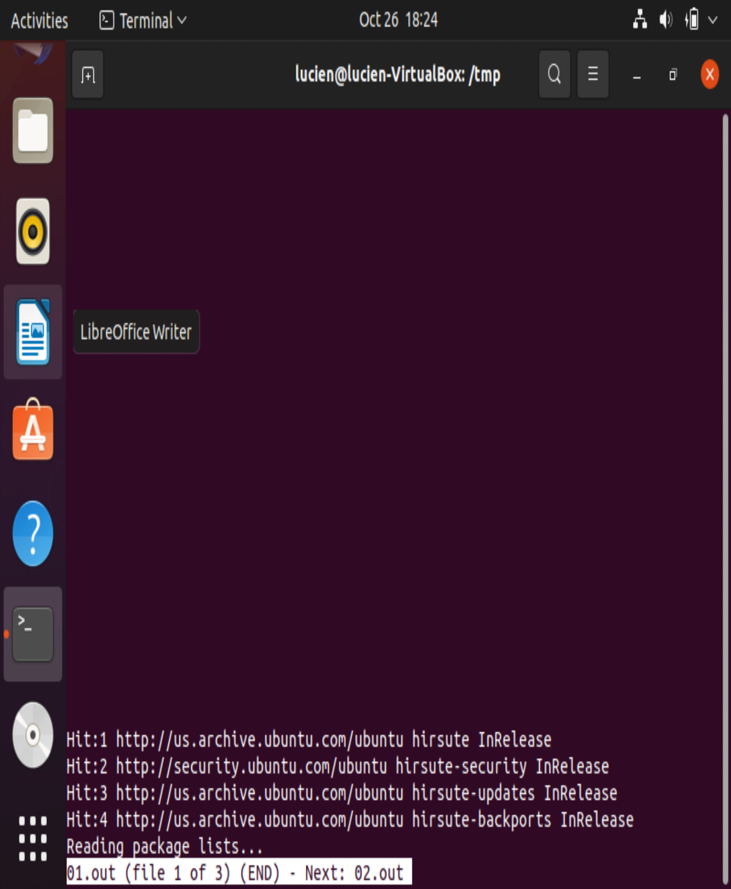
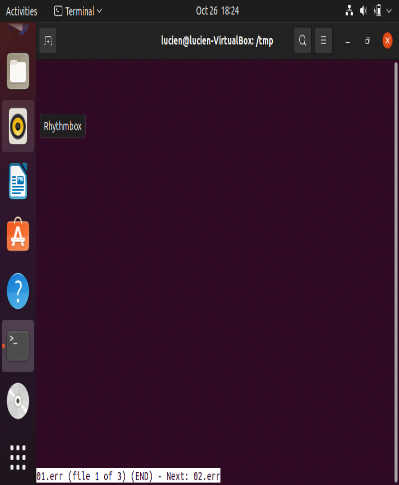
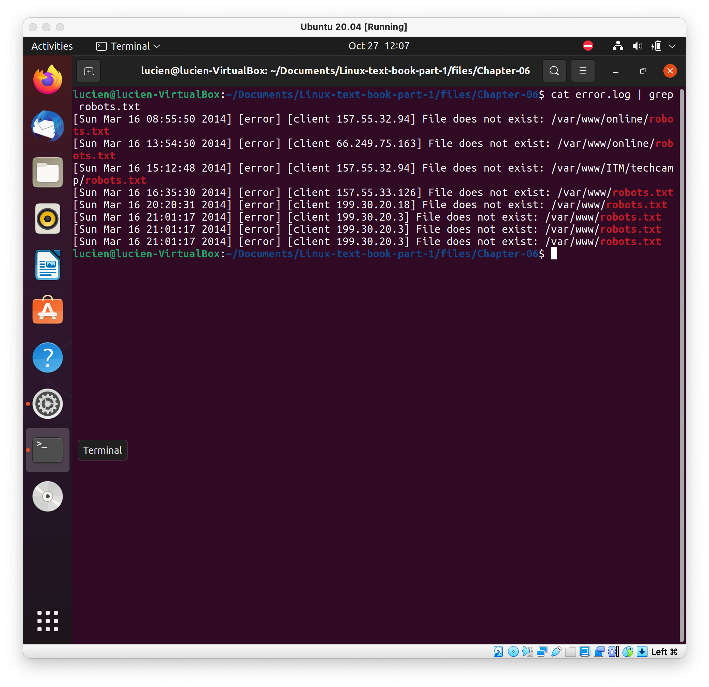
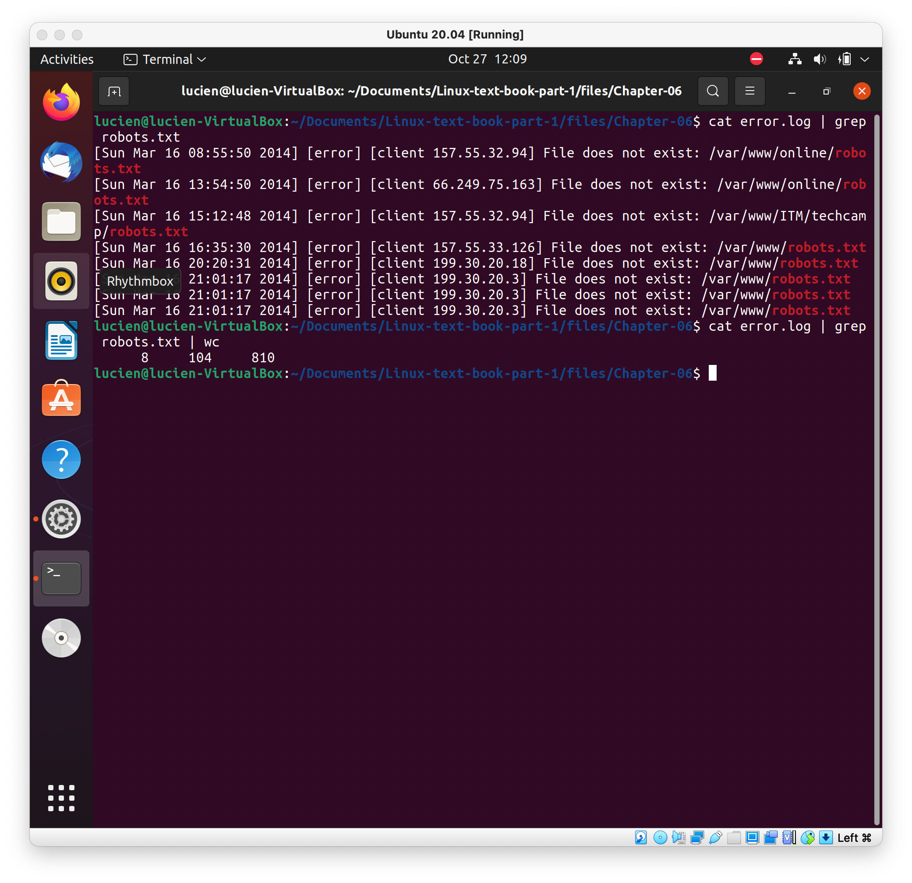

# Lab - Chapter 06

The objectives of this lab will be to use the shell and understand meta-characters, pipes, search, and tools. The outcome will be that you will be able to successfully use meta-characters for file creation, location, modification, and manipulation.  You will successfully master the concept of pipes and redirection as well.  Resist the temptation to use the GUI file manager and a web browser.  All actions will be done through the shell. You can use either an Ubuntu or a Fedora based OS.  **Deliverable:** Take a screenshot demonstrating the required output of each command.

1. Issue the command to clone a copy of the textbook code (if you have already done this in Lab 5 no need to repeat the step). Issue the command to `cd` into the `Linux-Text-Book-Part-I` directory. Type the command that will list every file in this directory that has any number of characters and a ```.sh``` two character file extension of any name


1. Type the command inside the textbook directory will do a *long listing* of Chapters-02, 04, 06, and 08 only


1. Type the command that will copy the file `Chapter-02/chapter-02.md` into the your home directory, then list the content of your home directory. Use the meta-character needed to execute the proceeding commands only if the previous command is true and place all these commands into one single line


1. In your home directory, using the meta-character, create these two series of files: ubuntu10.txt - ubuntu15.txt and redhat10.txt - redhat15.txt.  Create each series using a single command


1. In your home directory, using the meta-character, issue a command to list only the ubuntu10.txt - ubuntu15.txt files


1. In your home directory, using the meta-character, create the directories named: debian10, debian11, and debian12 with a single command




1. In your home directory, using the meta-character, delete the directories named debian10, debian11, and debian12 with a single command


1. In your home directory redirect the output of the `date` command into a file named: **today.txt**


1. In your home directory append the output of the `date +%m%d%Y` command to the file **today.txt** and display the content - you should see two formatted date entries


1. Create a shell variable named `UT`, assign the contents of the command ```uptime``` to `UT` and print a string to the screen with its value and with a string stating, "The system has been up for: " and then the value of UT.




1. Using an Ubuntu Desktop system, execute the following commands: ```sudo apt-get -y update 1>/tmp/01.out 2>/tmp/01.err``` ```sudo apt-get -y install nginx 1>/tmp/02.out 2>/tmp/02.err``` and ```sudo systemctl start nginx 1>/tmp/03.out 2>/tmp/03.err```. Issue the command to list the contents of the `/tmp` directory.


1. Display the contents of the \*.out files using a meta-character in one command and pipe the output to the ```less``` command




1. Display the contents of the \*.err files using a meta-character in one command and pipe its output to the ```less``` command. 




1. Type the command ```ls -l /topsecret``` and redirect both standard out and standard error to a file named: `/tmp/out-and-error.txt`


1. You will find a file named `hosts.deny` located in the directory `files` > `Chapter-06` of the download of the textbook. It contains a list of IP addresses - what command would you use to count ONLY the number of lines in the file?


1. Using the `error.log` file located in the directory `files` > `Chapter-06` - what command would you use to count only unique lines and to display their count and only if there is more than 1 occurrence?


1. What command would let you display the content of the `hosts.deny` file, cut out the the second column and sort it?


1. What command would let you search the file `error.log` for the lines that contain the term **robots.txt**?




1. What command would let you count the number of lines that have the term "robots.txt" in the file error.log?




1. Using the hosts.deny file, what command would you type to display the last 10 lines of the file, cut out the field with the IP address and sort them in ascending order?


1. Use the `grep` tool to search the file error.log for the line "Invalid method in request" and print to the screen the lines found.


1. Using tools discussed in this chapter and based on the contents of the file **error.log**, type the commands needed to find the following information:  How many unique IPs did the error messages come from? 


1. Home many unique URLs based errors (last column), and list all of the unique type of errors (second to last column).


1. Using the ```find``` command and starting from the \~ directory what would be the command to find all files with the name .md?


1. Using the `find` command and starting from your home directory, what would be the command to find all the files that have been modified in the previous hour?


