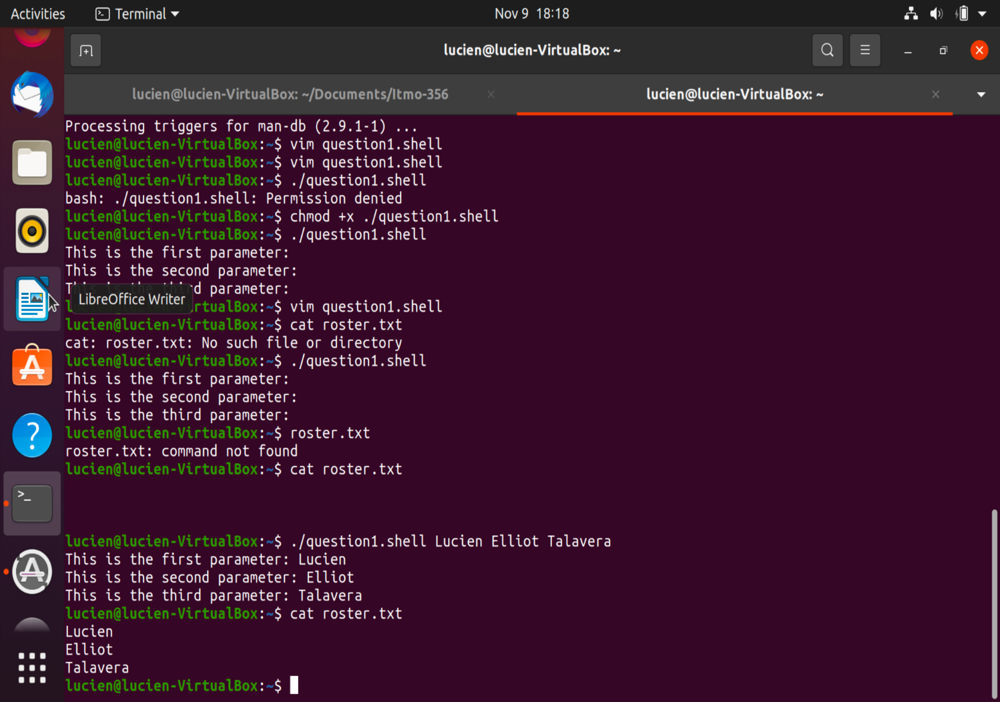
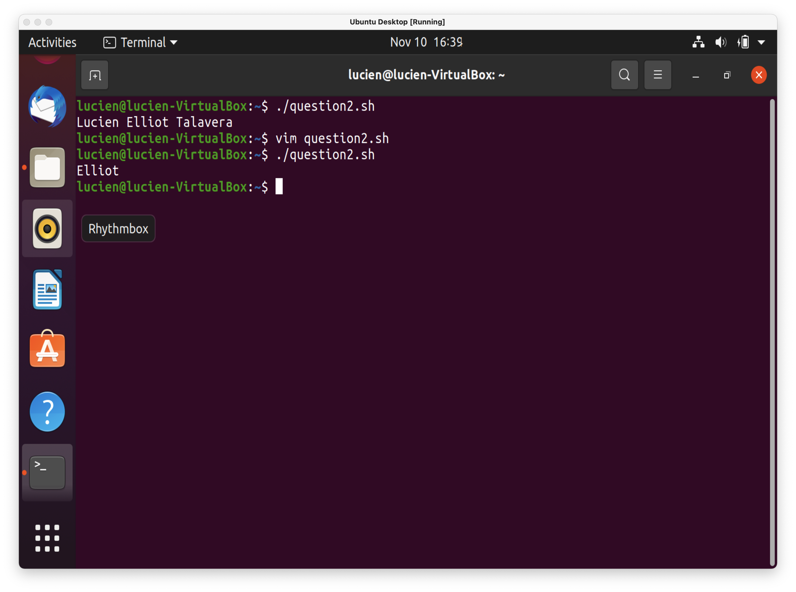
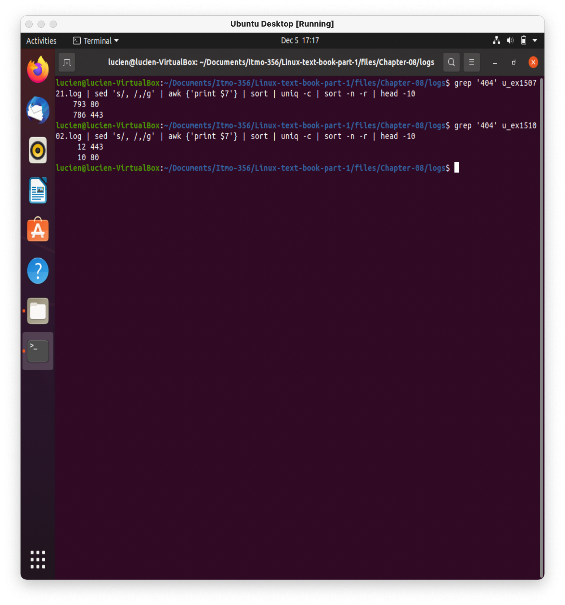

# Lab - Chapter 08

## Lab Objectives

This lab will allow you to create shell scripts.  Use positional parameters, control structures, and write cron jobs.

## Lab Outcomes

At the completion of this lab you will further your knowledge of shell scripting and enhance your abilities using Bash shell scripts.

1) Create a shell script that will take 3 positional parameters, append each parameter to a file named roster.txt (each of the parameters will be a name).



2) Create a shell script to cat the content of the roster.txt file into an array named: ROSTERARRAY and echo the 2nd element of the array.



3) Create a shell script that redirects the content of roster.txt into an array, uses a forloop to cycle through the array's contents, and then uses the command to make a directory for each name listed in the array in your home directory, echo a message telling the user the path of the directory just created. Final command of the script is to list the content of the home directory to show the success of the script.


1) Modify the shell script from the previous question to include an if statement that checks for the existence of a directory.  If the directory exists, echo a message: "Directory $NAME exists".  Then add an else clause that if the directory does not exist, create it and echo a message that the new directory and its path have been created.


1) Write a WHILE loop that will read the content of the file names.txt, (located in the files > Chapter-08 > lab folder) and create a directory based on the value on the line in the `/tmp` directory (one per users).  Include an if statement to detect if the directory already exists, if it does exist, write the duplicate name out to a text file named: `duplicates.txt` located in the `/tmp` directory.  
  


1) Write the syntax to make a cronjob execute 5 minutes past every hour everyday to execute the shell script you previously made to store the content of `ls -l ~` into an array named `DIRARR`.
  
1) Locate the file `install-java8.sh` located in the **files > Chapter-08 > lab** directory.  Modify the script to include IF statements to check for the existence of the path ```/datapool1``` and to print an error message if the path does not exist.
  
1) Modify `install-java8.sh` again--this time take a positional parameter and put that in place of the directory name `/datapool1` (this will allow you to customize the install location of the shell script).  

1) Create a directory in ```~``` named ```topsecret```.  In that directory create a file named `xfile.txt`.  Write a shell script to check if that file has executable permission by passing the filename as a positional parameter.  If TRUE print a message.  If FALSE print an error message that the positional parameter name of the file is not executable.
  
1) Write a shell script to check in the `~/topsecret` directory to see if a given file name exists (passed in by positional parameters).  If TRUE print a message else print an error message with the given file name being passed.
  
1) Write a shell script to check if a given PATH, via a positional parameter, $1, is a file or a directory.  If TRUE print a message, else print an error message using the given file name.
  
1) Write a shell script that takes 4 positional parameters.  In the shell script print out $0, $#, and $@ with an explanation of what these variables contain.
  
1) Write a `cron` job that executes the command, `sudo mysqldump --all-databases` at 11:59 pm on Sunday every week of the month.
  


  
1) Using `awk` and other tools, how would you find which ip caused the most HTTP 404 errors? Take a screenshot of the command and the output.  Use these two files in ```files/Chapter-08/logs```: u_ex150721.log, 


u_ex151002.log.


1) Using `awk` and other tools, how would you capture the top 5 offending IPs? Take a screenshot of the command and the output. Use these two files in ```files/Chapter-08/logs```: u_ex150721.log, u_ex151002.log.


1) Using `sed`, type the command to find the line **bind-address** located in the mariadb database server config file (you might need to install mariadb-server).  The file locations are: Fedora ```/etc/my.cnf.d/mariadb-server.cnf``` and Ubuntu ```/etc/mysql/mariadb.conf.d/50-server.cnf```.  Comment out the value, change the IP value to 0.0.0.0, and write the change back to the original file.  Take a screenshot of the output.

