# Lab 10

## Lab 10 Objectives

* Learn how to modify GRUB settings
* Use `systemctl` to start, stop, and examine processes in systemd
* Use `systemd-analyze` to understand what services are loading during system boot
* Learn how to change systemd targets
* List the kernel modules currently loaded on your Linux system

## Lab 10 Outcomes

At the conclusion of this lab, you will be able to manage, edit, and list system processes in systemd--helping you to master the concepts of systemd.  After each item take a screenshot and place it below the question to demonstrate the answer (unless specified otherwise).  Edit your screenshots to show just the relevant information.

1) Take a screenshot of the Advanced GRUB boot settings in an Ubuntu virtual Machine (you can access this menu by starting a virtual machine from a cold start, click your mouse into the virtualbox window immediately after the VM starts and hold the **shift** key down until you see the GRUB menu). Select the Advanced option and take the screenshot of the kernels and the recovery options.

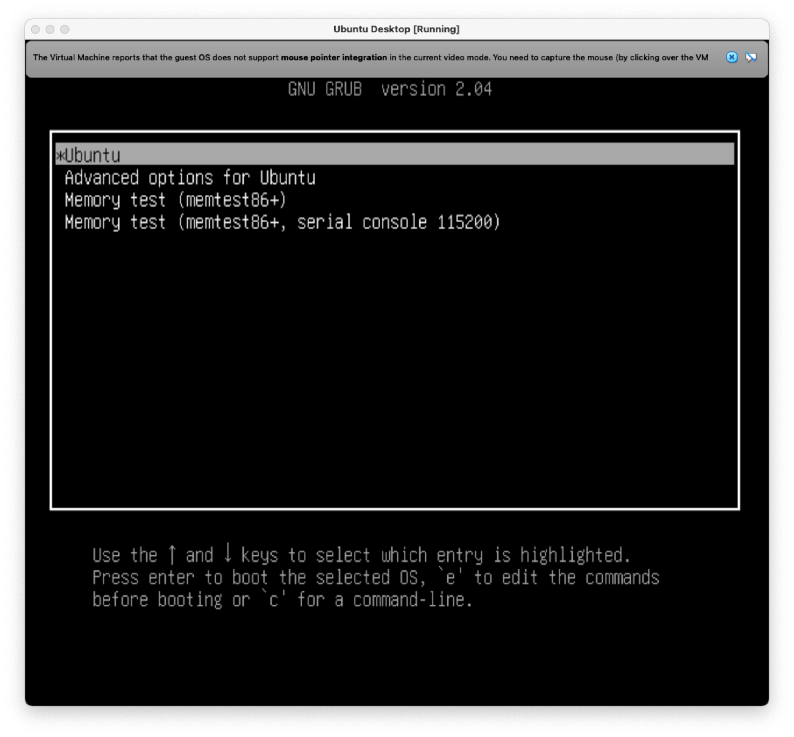

1) Change the default GRUB settings on your Ubuntu virtual machine uncommenting the entry `GRUB_DISABLE_RECOVERY="true"`.  Save the changes the GRUB configuration file, reboot the virtual machine, repeating the process in the first question, and now take a screenshot of the same menu that is missing the recovery options.

1) Use the `systemd-analyze` tool to print out the most recent boot times for your Fedora virtual machine.

1) Use the `systemd-analyze` tool to print out the most recent boot times for your Ubuntu virtual machine.

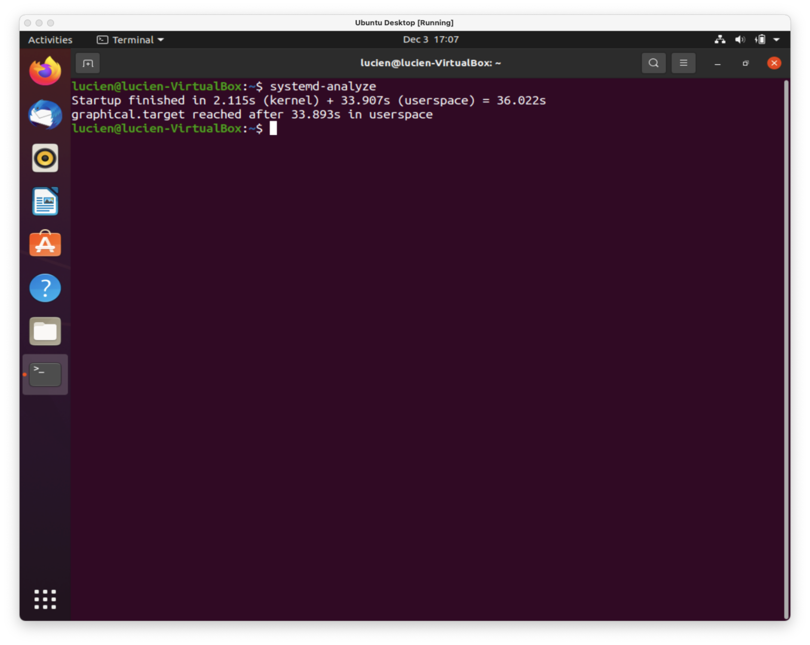

1) Install MariaDB server on Fedora, `sudo dnf install mariadb-server`.  Use the command `sudo systemctl status <servicename>` after MariaDB is installed to take a screenshot of the display of its current status. Enable the service via `systemctl`, and then start the service. Finally, reboot your system. Upon reboot, take a screenshot of the output of the systemctl status command for mariadb.service.

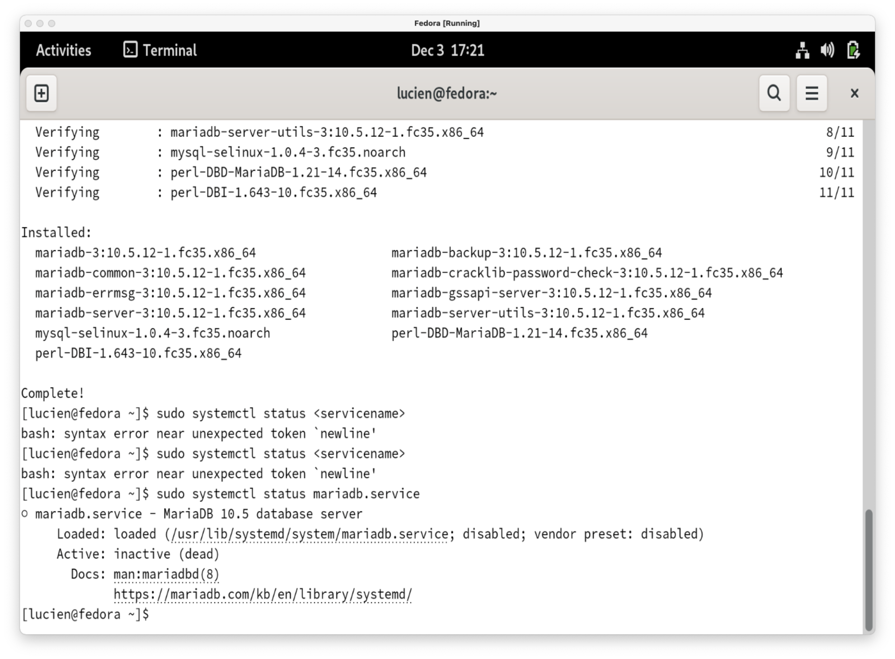
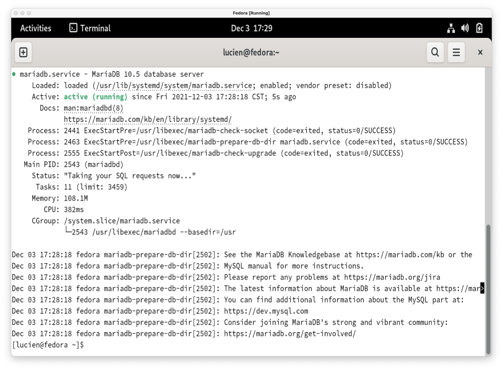

1) With MariaDB enabled on Fedora, use the `systemd-analyze` tool to print out the most recent boot time for your system again and compare this to the first boot time screenshot to see if adding this service increased the boot time.

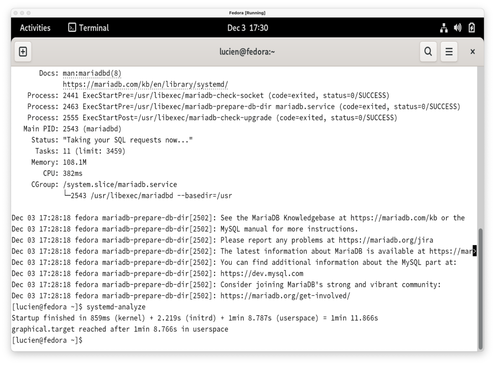

1) Use `systemctl` to enable and start the nginx.service (Fedora), open a webbrowser and navigate to http://127.0.0.1. Then issue the `systemctl` command to stop the nginx.service. Navigate again to http://127.0.0.1 and take a screenshot.

 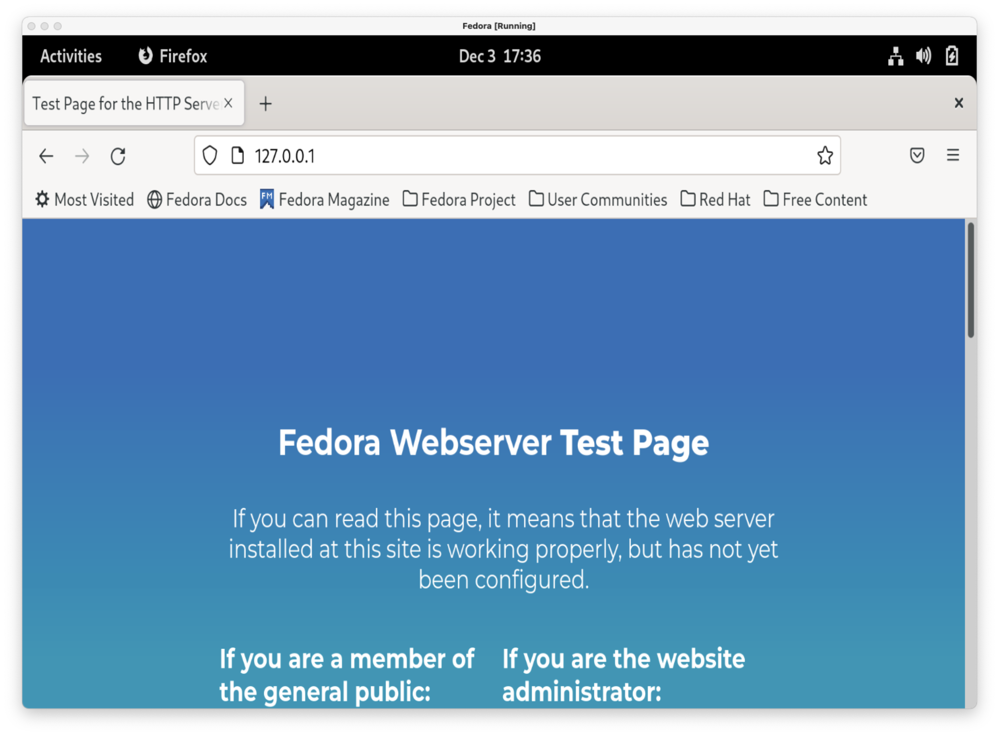
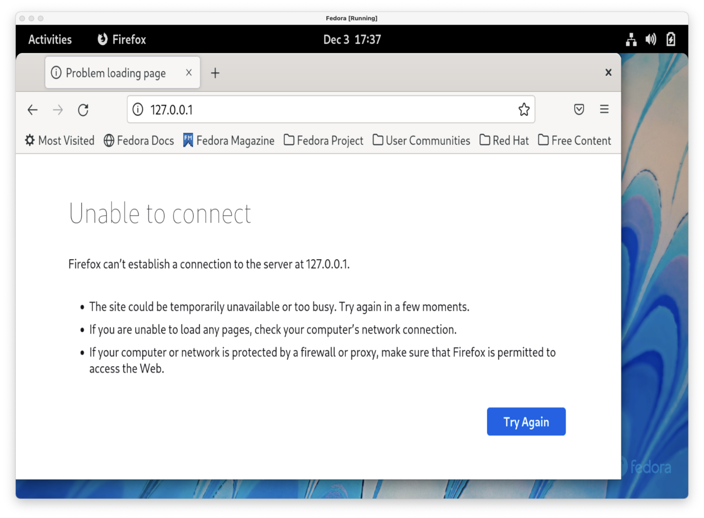
1) Change the `systemd` target to the systemd commandline-only level, display the `systemd` default target level.  Then change the run level back to the GUI target (or runlevel5)

 

1) Using systemctl and the `--show` option, display the "After" and "WantedBy" properties of the sshd.service.

1) Type one of the two commands mentioned in the chapter to display info about your CPU hardware (a single screenshot will do incase the output scrolls past one screen).

1) Using `systemctl status` command, find and display the status and cgroup information for the ngnix webserver and take a screenshot. Then issue a `kill -s SIGHUP` command to that service and take a screenshot of the results.

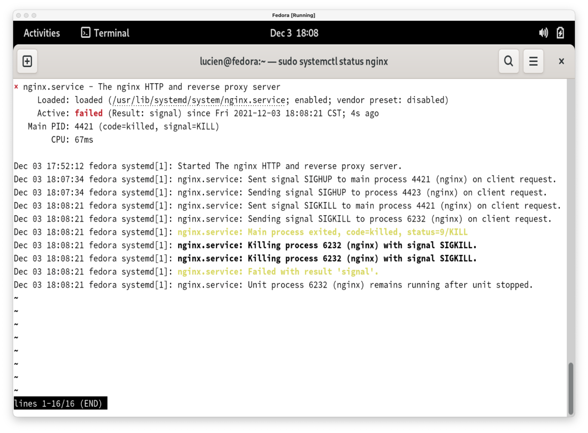

1) Using `systemd-cgls -u nginx.service` command and the SysVinit command, `ps -ef | grep nginx`, take a single screenshot of the combined output of the httpd.service process IDs.

1) show the output of the `timedatectl status` command before and after the timezone change. Use the `timedatectl` command to change the clock of your system to UTC.

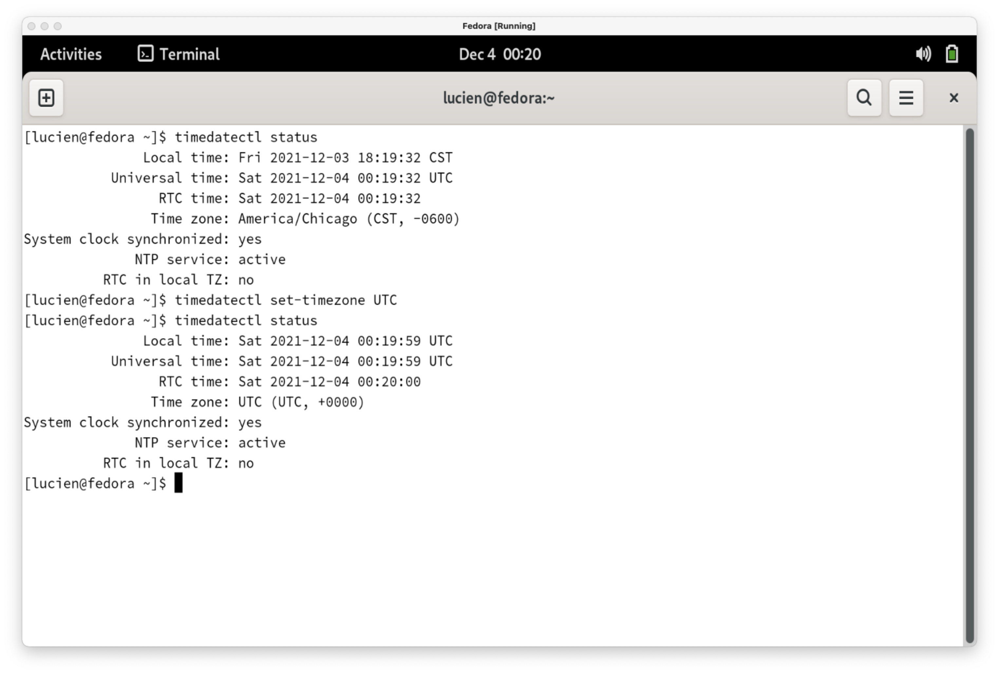

1) Use the `hostnamectl` command to:
   a) set-hostname to itmo-556-xyz (xyz is your initials)
   b) set-location to: d1r1u22
   c) set-chassis to: vm
   d) set-deployment to: development
   e) display the changes by issuing the `hostnamectl` command

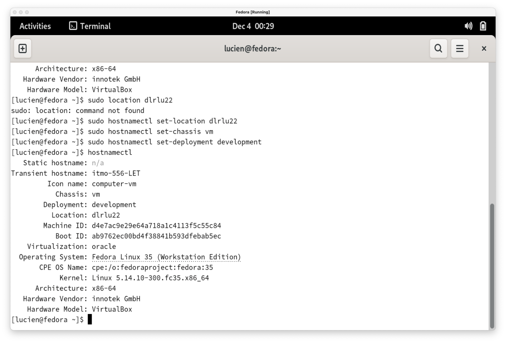

1) What would be the command to change the systemd target runlevel to recovery mode?  Execute this command and take a screenshot of the result -- then change it back to the regular GUI interface.

1) Review the content of the mariadb.service file. List the contents of the `[Install]` header that must load before and after the mariadb service starts (assume that mariadb-server package is installed)

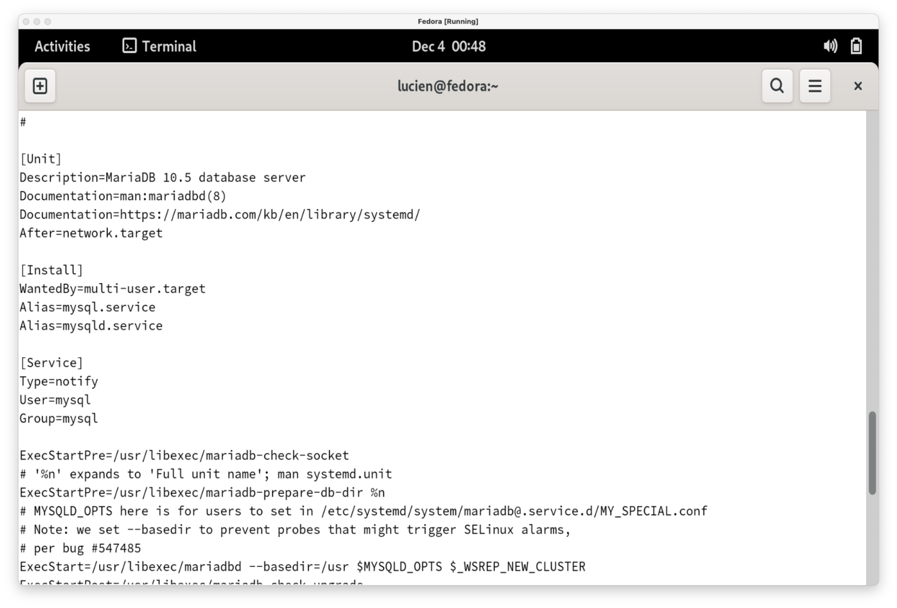

1) Find the sample file located in: files > Chapter-10 > python > iloop.py.  Copy this file to `/usr/local/bin` and then execute the file by typing: `iloop.py`, type Ctrl+C to exit: take a screenshot of the output

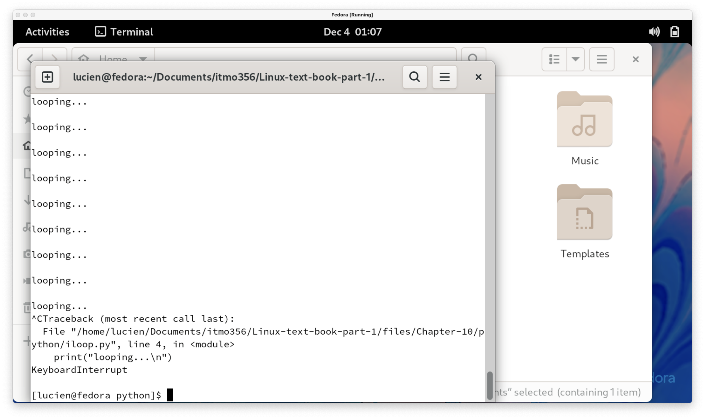

1) Copy the sample template file located in: files > Chapter-10 > python > iloop.service to your `/lib/systemd/system` directory. Edit the iloop.service file adding a description, type simple, private tmp true, wantedby multi-user.target, and ExecStart the absolute path to the python3 binary and absolute path to iloop.py.  Take a screenshot of the output of the systemctl start command and then the status command.

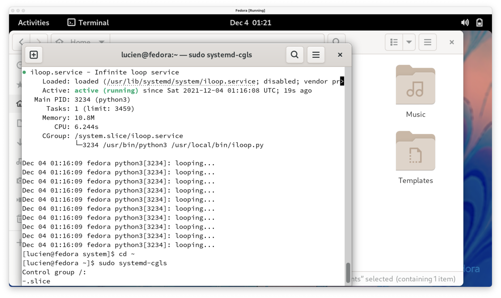

1) Using the `systemd-cgls` command find the cgroup ID for the iloop.service and take a screenshot of that entry. After taking the screenshot execute the systemctl stop command for the iloop.service.

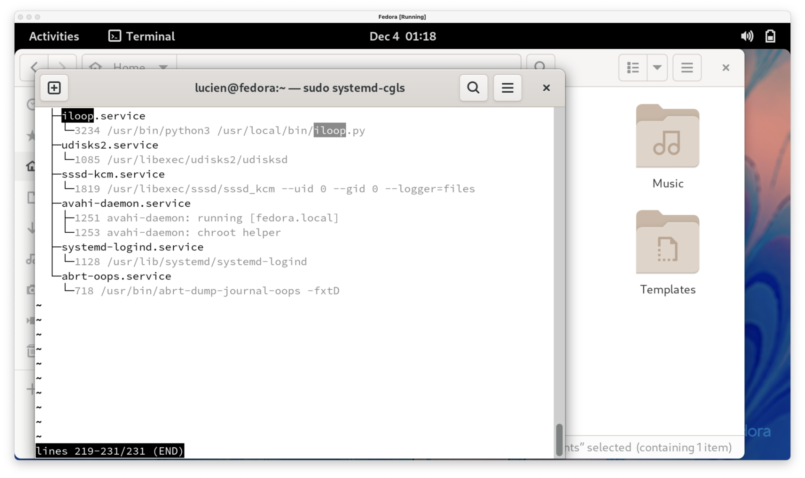

1) Take a screenshot of the output of the command: `systemctl list-timers`, make sure the terminal is expanded to include the UNIT column in the screenshot.

1) Copy the sample template file located in: files > Chapter-10 > python > iloop.timer to your `/lib/systemd/system` directory. Edit the .timer file configuring the onCalander value for execution 3 minutes from the current time.  This is so you can see the results of the scheduled task execute. Take a screenshot of the output of the command: `systemctl list-timers` showing the iloop timer as active, make sure the terminal is expanded to include the UNIT column in the screenshot.

1) Find the sample file located in: files > Chapter-10 > python > write-journal.py and copy it to `/usr/local/bin`. Execute the command `write-journal.py`.  Use the `journalctl -xe` command and show the output message in the journald logs.
