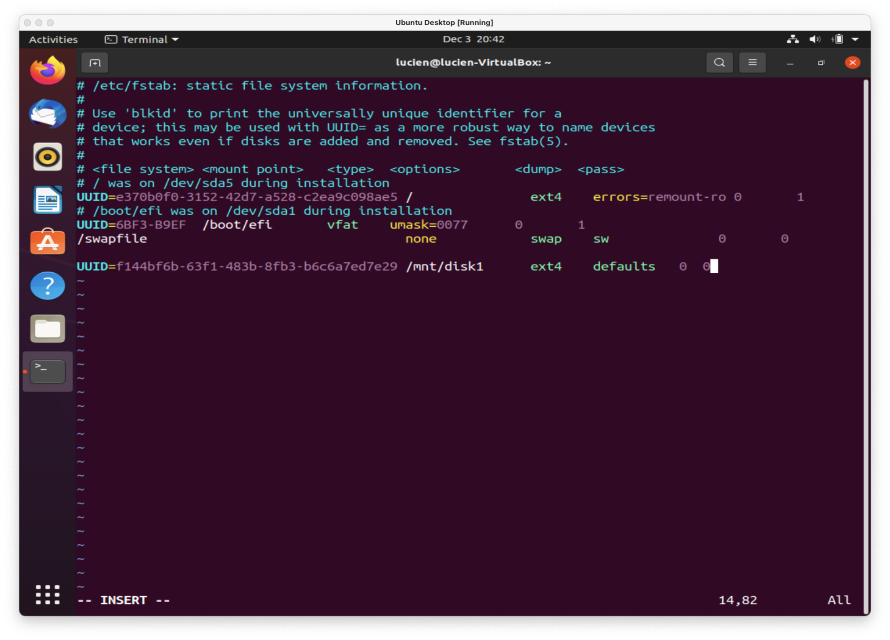
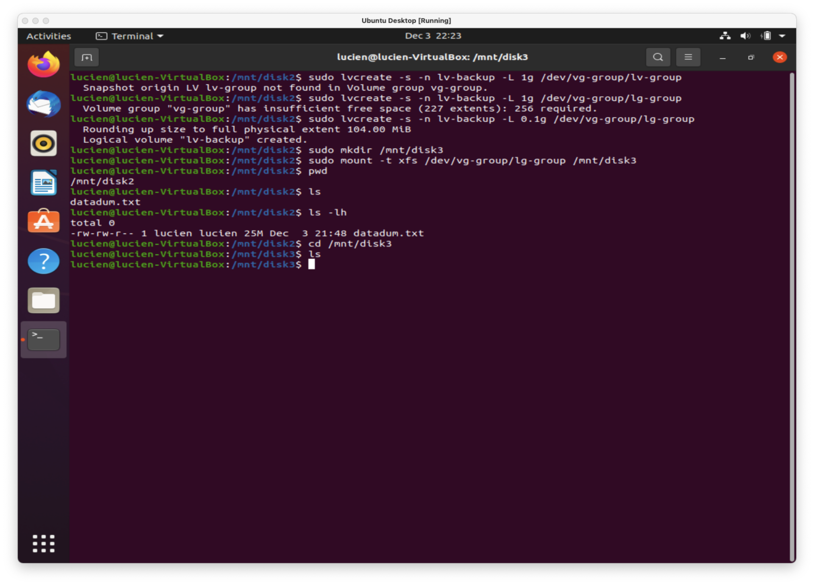

# Lab - Chapter 11

## Lab 11 Objectives

* Creating virtual disks in VirtualBox
* Creating new partitions in fdisk
* Creating new filesystems with mkfs
* Creating new filesystems in ZFS and Btrfs
* Mounting new filesystems
* Editing `/etc/fstab` and using systemd .mount files to make our mounts permanent

## Lab 11 Outcomes

At the conclusion of this lab you will have successfully created a new virtual disk in VirtualBox, created new partitions using fdisk, formatted those partitions using mkfs, XFS, and ZFS, and mounted all those partitions manually and automatically using the `/etc/fstab`.

## Lab 11 Activities

For each of the bullet points, take a screenshot of the output of the commands to display the content to demonstrate the concepts.  Note - make your screenshot efficient, and capture only relevant data along with numbering the output.  All disks that are created can be 2 GB unless noted.

1. Create 1 virtual drive in VirtualBox:

   a. Use fdisk to create a primary partition
   b. Format it with ext4
   c. Mount it to /mnt/disk1
   d. Add it to your fstab


   
      
         
            


2. Create 2 more virtual drives:

   a. Create a single volume group named vg-group
   b. Create 1 logical volume named lv-group using the two drives
   c. Format it with XFS
   d. Mount it to /mnt/disk2
   e. Add the lv-group to your fstab, using the disk path to the logical volume not the UUID
   f. Reboot the system and `cat` the  `/etc/fstab` and show that your entry is present


3. Using the same LVM as before:

   a. Add an additional VirtualBox disk and the create a LVM physical disk
   b. Grow the volume group and logical volume
   c. Grow the XFS file system

   

4. Using section 11.7.4 you will create a ZFS snapshot and roll back to it

   a. Create a two disk ZFS stripe named `memorycache`
   b. Change the ownership on the `/memorychace` volume to `controller:controller`
   c. Change directory to `/memorycache` and display your `pwd`
   d. Issue the command: `truncate -s 500m accounts.csv` to create a 500 mb file named accounts.csv
   e. Create a ZFS snapshot of the memorycache volume named: `mc-snap1`
   f. Using the `truncate` command create two more files: ubunut-distros.csv and fedora-distros.csv of 100 mb on the `/memorycache` volume
   g. Issue the `ls -lh` command on the `/memorycache` volume to show that the new files have been created
   h. Using the zfs list command list the current snapshots
   i. Using the zfs rollback command the `mc-snap1` snapshot
   j. Issue the `ls -lh` command on the `/memorycache` volume to show that the snapshot has been rolled back




5. Using Ubuntu 20.04 and ZFS, attach four 1 GB disks and create RAID 10 (a mirrored stripe). Name the pool: `datapool`. Display the `zpool status` and take a screenshot of the output.


6. Using Ubuntu 20.04, attach 4 virtual disks of 1 GB each. Create two Btrfs mirrored drives named disk1 and disk2.  Take a screenshot of the output of the `btrfs filesystem show` command for each disk.


7. Using Fedora, attach 4 1 GB disks in a Btrfs stripe.  

    a. Take a screenshot of the `btrfs filesystem df` command for this volume.  
    b. Then remove one of the virtual disks from the stripe.  Take a screenshot of the `btrfs filesystem df` command for this volume.
    c. Attach an additional 2 gb disk to the Btrfs stripe. Take a screenshot of the `btrfs filesystem df` command for this volume.  
    d. Extend the Btrfs filesystem to encompass using all of the new disk space. Take a screenshot of the `btrfs filesystem df` command for this volume.

8. On the zpool named `datapool` on Ubuntu 20.04 from question 5:

    a. Execute a ```zpool status``` command
    b. Enable LZ4 compression on the zpool datapool
    c. Execute a `zfs get all | grep compression` command to display that compression is enabled

9. On your Fedora system execute, any of the commands listed to print out the disk serial numbers.

10. Attach an additional 2 GB virtual disk and format it with Btrfs and we will mount is in read-only mode. Using the command `lsblk --fs /dev/sdX` determine the UUID of the newest virtual disk you just created.  Add an entry for this disk to the `/etc/fstab` file with the following values:

    a. file system is UUID=
    b. mount point is `/mnt/disk100` (create this partition if it doesn't exist)
    c. type is btrfs
    d. options: defaults,ro  (ro for read-only)
    e. dump and pass fields can be 0
    f. Change owner and group to your username for `/mnt/disk100` (using `chmod`)
    g. Reboot your system. Change directory to `/mnt/disk100` and take a screenshot to demonstrate that the disk is in read-only mode by trying to create a file via this command:  `touch demo.txt`

11. Using `wget`, retrieve this URL: https://mirrors.edge.kernel.org/pub/linux/kernel/v5.x/linux-5.11.19.tar.xz

   a. Untar/uncompress this archive.
   b. Tar the directory and compress it using bzip2, make sure to keep the original input
   c. Tar the directory and compress it using gzip, make sure to keep the original input
   d. Tar the directory and compress it using ztd, make sure to keep the original input
   e. Tar the directory and compress it using xz, make sure to keep the original input
